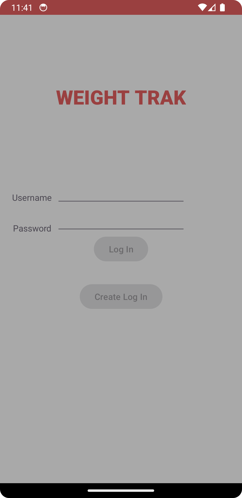
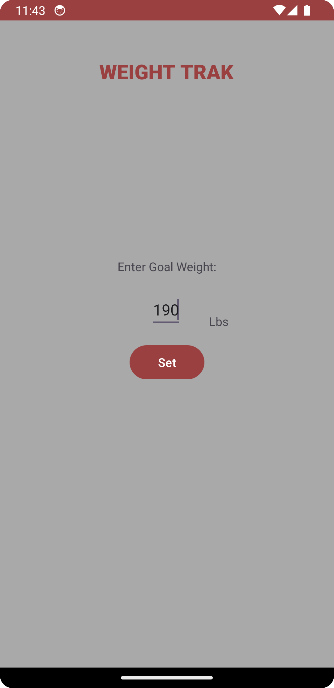
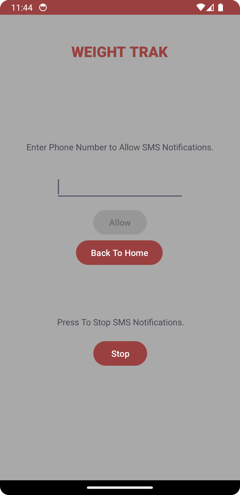
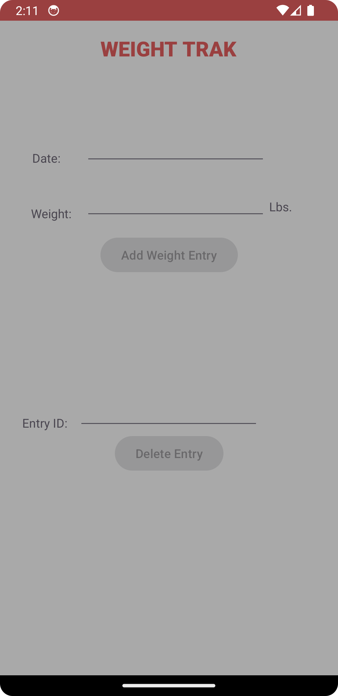
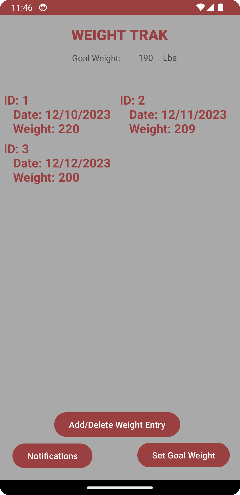

# WeightTrak

## Description
Simple weight tracking app built using Java on Android Studio for a school project. A user is able to track their daily weight along with setting a goal weight. Once a user reaches their goal weight the app notifies them via a toast or SMS message if that permission is enabled. Data is stored using SQLite.

## Screens

